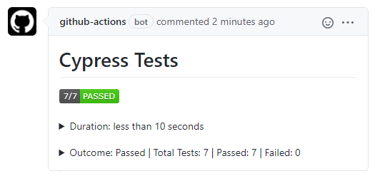
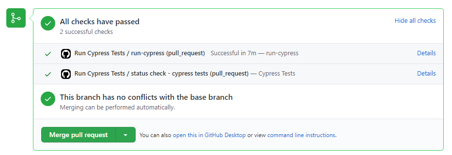
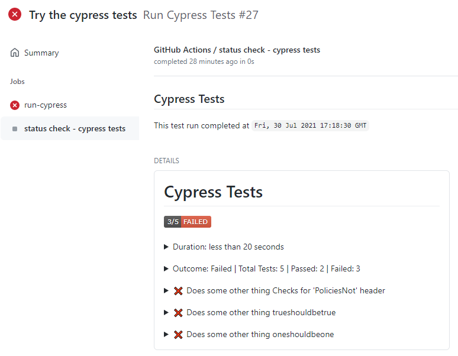

# process-cypress-test-results

This action works in conjunction with another step that runs `cypress run --reporter mochawesome `.  This action takes the generated results json file and creates a Status Check or PR Comment depending on the flags set with the test outcome.  

This action does not run the Cypress tests itself and it can only process one results file at a time.
    
## Index 

- [Failures](#failures)
- [Limitations](#limitations)
- [Action Outputs](#action-outputs)
  - [Pull Request Comment](#pull-request-comment)
  - [Pull Request Status Check](#pull-request-status-check)
  - [Workflow Run](#workflow-run)
  - [Failed Test Details](#failed-test-details)
- [Inputs](#inputs)
- [Outputs](#outputs)
- [Usage Examples](#usage-examples)
  - [npm setup](#npm-setup)
  - [Workflow](#workflow)
- [Contributing](#contributing)
  - [Recompiling](#recompiling)
  - [Incrementing the Version](#incrementing-the-version)
- [Code of Conduct](#code-of-conduct)
- [License](#license)

## Failures
The status check can be an item on the workflow run, a PR comment or on the PR Status Check section.  If the test results contain failures, the status check will be marked as failed. Having the status check marked as failed will prevent PRs from being merged. If this status check behavior is not desired, the `ignore-test-failures` input can be set and the outcome will be marked as neutral if test failures are detected. The status badge in the comment or status check body will still indicate a failure.

## Limitations
GitHub does have a size limitation of 65535 characters for a Status Check body or a PR Comment.  This action will fail if the test results exceed the GitHub [limit].  To mitigate this size issue only failed tests are included in the output.

If you have multiple workflows triggered by the same `pull_request` or `push` event, GitHub creates one checksuite for that commit.  The checksuite gets assigned to one of the workflows randomly and all status checks for that commit are reported to that checksuite. That means if there are multiple workflows with the same trigger, your status checks may show on a different workflow run than the run that created them.

## Action Outputs
### Pull Request Comment
This is shown on the pull request when the `create-pr-comment` is set to `true` and there is a PR associated with the commit.
<kbd></img></kbd>

### Pull Request Status Check
This is shown on the pull request when the `create-status-check` is set to `true` and there is a PR associated with the commit.
<kbd></img></kbd>

### Workflow Run
This is shown on the workflow run when the `create-status-check` is set to `true`.
<kbd></img></kbd>

### Failed Test Details
For failed test runs you can expand each failed test and view more details about the failure
<kbd></img></kbd>

## Inputs
| Parameter                      | Is Required | Default              | Description                                                                                                                                                                         |
| ------------------------------ | ----------- | -------------------- | ----------------------------------------------------------------------------------------------------------------------------------------------------------------------------------- |
| `github-token`                 | true        | N/A                  | Used for the GitHub Checks API.  Value is generally: secrets.GITHUB_TOKEN.                                                                                                          |
| `results-file`                 | true        | N/A                  | The json results file generated by cypress & mochawesome reporter.                                                                                                                  |
| `report-name`                  | false       | Cypress Test Results | The desired name of the report that is shown on the PR Comment and inside the Status Check.                                                                                         |
| `create-status-check`          | false       | true                 | Flag indicating whether a status check with cypress test results should be generated.                                                                                               |
| `create-pr-comment`            | false       | true                 | Flag indicating whether a PR comment with cypress test results should be generated.  When `true` the default behavior is to update an existing comment if one exists.               |
| `update-comment-if-one-exists` | false       | true                 | When `create-pr-comment` is true, this flag determines whether a new comment is created or if the action updates an existing comment if one is found which is the default behavior. |
| `ignore-test-failures`         | false       | `false`              | When set to true the check status is set to `Neutral` when there are test failures and it will not block pull requests.                                                             |
| `timezone`                     | false       | `UTC`                | IANA time zone name (e.g. America/Denver) to display dates in.                                                                                                                      |


## Outputs
| Output         | Description                                                                                                                                                           |
| -------------- | --------------------------------------------------------------------------------------------------------------------------------------------------------------------- |
| `test-outcome` | Test outcome based on presence of failing tests: *Failed,Passed*<br/>If exceptions are thrown or if it exits early because of argument errors, this is set to Failed. |

## Usage Examples
### npm setup
1. These examples require a few npm packages to be installed, generally as dev dependencies:
   - mochawesome
   - mochawesome-merge
   - mochawesome-report-generator
2. Some npm scripts have also been added to the project   
    ```json
    "scripts": {
      "precypressrun": "rm -rf mochawesome-report/", 
      "cypressrun": "cypress run --project ./ --reporter mochawesome --reporter-options overwrite=false,html=false,json=true",
      "cypressreport": "mochawesome-merge mochawesome-report/*.json > raw-results.json && marge --reportDir cypress-results raw-results.json"
    }
    ```
    - `cypressrun`:
      - `overwrite=false`: This flag is set to false so a separate json file is created per test/suite.  If not set, each test overwrites the previous test results so a comprehensive report cannot be generated.    
      - `html=false`:  This tells *mochawesome* not to generate an html report since we'll be doing that after the test run.
      - `json=true`: This tells *mochawesome* to generate json result files which we will be merged together in the `cypressreport` script.
    - `precypressrun`:
      -  Since the `overwrite` flag is false, we need a way to remove results between test runs which is what this script does.  By default *mochawesome* puts the results in the `mochawesome-report` directory.
    - `cypressreport`:
      - `mochawesome-merge mochawesome-report/*.json > raw-results.json`: merges all json files into one
      - `marge --reportDir cypress-results raw-results.json`: Generates the html report from the merged json file and puts it in the `cyress-results` directory

A step by step tutorial that sets up *mochawesome* can be found on [Test reporting with Cypress and Mochawesome].

### Workflow

```yml
jobs:
  advanced-cypress:
    runs-on: windows-2019
    
    env:
      APP_DIR: './src/MyProject/FrontEnd'
    
    defaults:
      run: 
        shell: bash
        working-directory: ${{ env.APP_DIR }}

    steps:
      - uses: actions/checkout@v2

      - name: Restore npm packages
        run: npm install

      - name: dotnet build & run the app
        working-directory: ./
        run: |
          dotnet build DemoApp15.sln
          dotnet run

      - name: Run cypress
        id: cypress
        continue-on-error: true
        run: npm run cypressrun

      # This creates the json file needed for this action
      - name: Merge results into a single json and create html report
        run: npm run cypressreport
        
      - name: Create Status check based on merged cypress results
        if: always()
        id: process-cypress
        uses: im-open/process-cypress-test-results@v2.0.5
        with:
          github-token: ${{ secrets.GITHUB_TOKEN }}
          results-file: '${{ env.APP_DIR }}/raw-results.json' # Name set up in npm script `cypressreport`
          report-name: 'Cypress ${{ github.run_number }}'     # Default: Cypress Test Results
          create-status-check: true                           # Default: true
          create-pr-comment: false                            # Default: true
          update-comment-if-one-exists: false                 # Default: true
          ignore-test-failures: true                          # Default: false
          timezone: 'america/denver'                          # Default: UTC
      
      - name: Fail if there were errors in the cypress tests
        if: steps.process-cypress.outputs.test-outcome == 'Failed'
        run: |
          echo "There were cypress test failures."
          exit 1
```

## Contributing

When creating new PRs please ensure:
1. The action has been recompiled.  See the [Recompiling](#recompiling) section below for more details.
2. For major or minor changes, at least one of the commit messages contains the appropriate `+semver:` keywords listed under [Incrementing the Version](#incrementing-the-version).
3. The `README.md` example has been updated with the new version.  See [Incrementing the Version](#incrementing-the-version).
4. The action code does not contain sensitive information.

### Recompiling

If changes are made to the action's code in this repository, or its dependencies, you will need to re-compile the action.

```sh
# Installs dependencies and bundles the code
npm run build

# Bundle the code (if dependencies are already installed)
npm run bundle
```

These commands utilize [esbuild](https://esbuild.github.io/getting-started/#bundling-for-node) to bundle the action and
its dependencies into a single file located in the `dist` folder.

### Incrementing the Version

This action uses [git-version-lite] to examine commit messages to determine whether to perform a major, minor or patch increment on merge.  The following table provides the fragment that should be included in a commit message to active different increment strategies.
| Increment Type | Commit Message Fragment                     |
| -------------- | ------------------------------------------- |
| major          | +semver:breaking                            |
| major          | +semver:major                               |
| minor          | +semver:feature                             |
| minor          | +semver:minor                               |
| patch          | *default increment type, no comment needed* |

## Code of Conduct

This project has adopted the [im-open's Code of Conduct](https://github.com/im-open/.github/blob/master/CODE_OF_CONDUCT.md).

## License

Copyright &copy; 2021, Extend Health, LLC. Code released under the [MIT license](LICENSE).

[limit]: https://github.com/github/docs/issues/3765
[Test reporting with Cypress and Mochawesome]: https://www.mariedrake.com/post/test-reporting-with-cypress-and-mochawesome
[git-version-lite]: https://github.com/im-open/git-version-lite